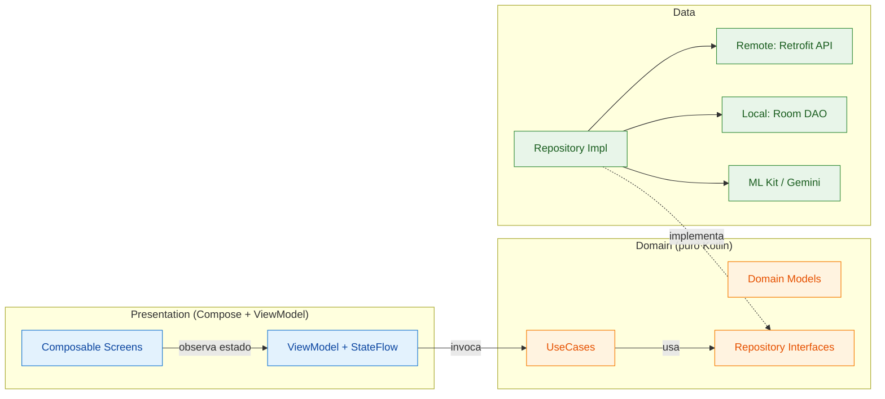
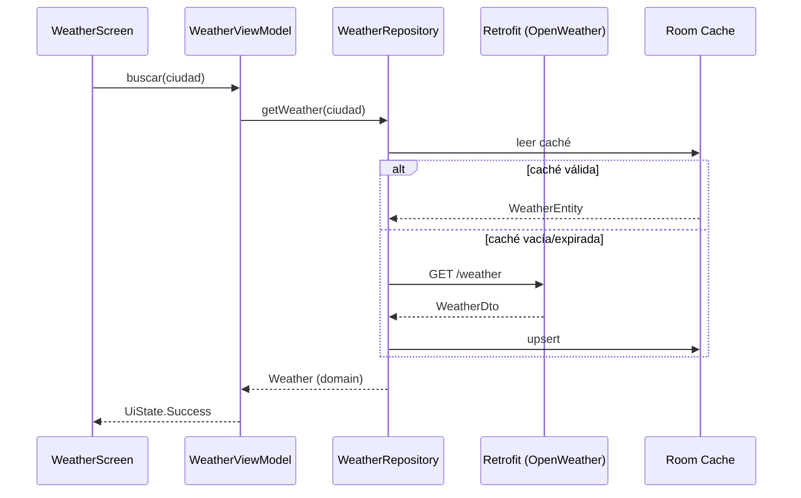
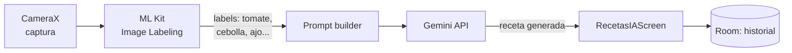

<div align="center">

# Jetpack Compose Workshops

Colección de seis aplicaciones Android construidas con **Jetpack Compose**, **Kotlin** y arquitectura limpia. Cada proyecto explora una capacidad distinta del stack moderno de Android: navegación declarativa, networking, persistencia local, gráficos, cámara, ML on-device e integración con LLMs.

[](https://kotlinlang.org/)
[](https://developer.android.com/jetpack/compose)
[](https://m3.material.io/)
[](https://developer.android.com/about/versions/nougat)
[](https://developer.android.com/about/versions/15)
[](https://docs.gradle.org/current/userguide/kotlin_dsl.html)

</div>

---

## Integrantes

- **Andrés Felipe López Molina**
- **Andrés Felipe Carvajal**

---

## Índice de proyectos

| # | Proyecto | Concepto | Tech destacada |
|---|---|---|---|
| 01 | [`taller01-hola-compose`](./taller01-hola-compose) | Primer contacto con Compose, layouts y temas | Compose, Material 3 |
| 02 | [`taller02-tareas`](./taller02-tareas) | Lista/detalle con navegación declarativa y estado en memoria | Navigation Compose, ViewModel |
| 03 | [`taller03-clima`](./taller03-clima) | Cliente REST con caché local y DI | Retrofit, Moshi, Room, Hilt |
| 04 | [`taller04-finanzas`](./taller04-finanzas) | Clean Architecture completa con gráficos | Hilt, Room, UseCases, Vico Charts |
| 05 | [`taller05-recetas`](./taller05-recetas) | Visión por computador + IA generativa | CameraX, ML Kit, Gemini API |
| — | [`NewsApp`](./NewsApp) | App de noticias con ContentProvider y caché | Retrofit, Room, Hilt, ContentProvider |

---

## Stack tecnológico

<table>
<tr>
<td>

**UI**
- Jetpack Compose (BOM)
- Material 3
- Material Icons Extended
- Coil 3 (imágenes)

</td>
<td>

**Arquitectura**
- MVVM + Clean Architecture
- Hilt (Dagger) — DI
- Navigation Compose
- ViewModel + StateFlow

</td>
<td>

**Datos**
- Retrofit 2/3 + Moshi/Gson
- OkHttp Logging Interceptor
- Room (SQLite KTX)
- ContentProvider (NewsApp)

</td>
</tr>
<tr>
<td>

**Gráficos y visualización**
- Vico Compose (charts)
- Material 3 cards/lists

</td>
<td>

**Cámara y ML**
- CameraX (core, camera2, lifecycle, view)
- ML Kit Image Labeling (on-device)

</td>
<td>

**IA generativa**
- Google Gemini API
- OpenWeather API

</td>
</tr>
</table>

---

## Arquitectura general

Los talleres 03, 04 y 05 siguen **Clean Architecture** en tres capas. El flujo unidireccional de datos garantiza que la UI dependa de abstracciones, no de implementaciones.



> **Regla de dependencias:** Presentation → Domain ← Data. La capa Domain no conoce a las otras; las capas externas dependen de sus abstracciones (DIP).

Más detalle, decisiones y diagramas adicionales en [`docs/architecture.md`](./docs/architecture.md).

---

## Detalle por proyecto

### Taller 01 — Hola Compose
Introducción a Jetpack Compose: composables, estado básico, `remember`, modificadores y theming Material 3.

**Estructura:** plana, una sola pantalla. Sin capas adicionales.

---

### Taller 02 — Tareas
Lista y detalle de tareas con navegación type-safe. Estado en memoria gestionado por `ViewModel`.

**Conceptos clave**
- `NavHost` + rutas tipadas
- Patrón lista → detalle con paso de argumentos
- `rememberSaveable` para resistir recreación

**Paquetes:** `model/`, `ui/lista/`, `ui/detalle/`, `ui/theme/`

---

### Taller 03 — Clima
Cliente meteorológico real contra OpenWeatherMap, con caché local y DI.

**Flujo de datos**



**Stack:** Retrofit + Moshi + OkHttp logging, Room, Hilt, Coil.

---

### Taller 04 — Finanzas
Gestor de movimientos personales con visualización de tendencias.

**Características**
- Clean Architecture completa con UseCases
- Persistencia con Room (DAOs + entities + mappers)
- Gráficos con **Vico Compose** (line/bar charts integrados a Material 3)
- Coroutines + Flow para reactividad

**Paquetes:** `data/{local,mapper,repository}`, `domain/{model,repository,usecase}`, `presentation/lista/`, `di/`

---

### Taller 05 — Recetas con IA
Identifica ingredientes con la cámara y sugiere recetas con un LLM.

**Pipeline**



**Stack:** CameraX (core/camera2/lifecycle/view), ML Kit Image Labeling on-device, Gemini API, Room para historial, Hilt.

---

### NewsApp
App de noticias con caché local persistente y exposición de datos vía `ContentProvider`.

**Highlights**
- ContentProvider público para que otras apps consulten artículos cacheados
- Retrofit 3 + Gson, OkHttp Logging Interceptor
- Room como single source of truth, política offline-first

**Paquetes:** `db/`, `model/`, `repository/`, `provider/`, `navigation/`, `ui/screen/`, `viewmodel/`, `di/`

---

## Setup

### Requisitos

- **Android Studio** Ladybug (2024.2) o superior
- **JDK** 17
- **Android SDK** 35 (mínimo) — 36 para `NewsApp`
- Un **emulador AVD** o dispositivo físico con API ≥ 24

### 1. Clonar

```bash
git clone git@github.com:bl00p1ng/jetpack.git
cd jetpack
```

### 2. Configurar API keys

Los talleres 03 y 05 requieren API keys externas. Hay archivos `local.properties.example` en cada uno como plantilla.

| Proyecto | Variable | Dónde obtenerla |
|---|---|---|
| `taller03-clima` | `OPENWEATHER_API_KEY` | https://openweathermap.org/api |
| `taller05-recetas` | `GEMINI_API_KEY` | https://aistudio.google.com/app/apikey |

```bash
cp taller03-clima/local.properties.example taller03-clima/local.properties
cp taller05-recetas/local.properties.example taller05-recetas/local.properties
# editar y completar las keys
```

> **`local.properties` está en `.gitignore`.** Nunca debe commitearse. Si alguna vez aparece en `git status` como modificado, **no lo agregues**.

### 3. Lanzar una app

#### Opción A — script CLI (sin Android Studio)

Incluye `run-app.sh` que detecta el SDK, levanta el emulador, instala el APK y abre la activity:

```bash
./run-app.sh                       # menú interactivo
./run-app.sh taller03-clima        # proyecto específico
./run-app.sh NewsApp Pixel_7_API_35  # proyecto + AVD
./run-app.sh -l                    # listar proyectos y AVDs
```

#### Opción B — Android Studio

Abre la carpeta del taller deseado como proyecto independiente (no la raíz). Sync Gradle y `Run`.

#### Opción C — Gradle directo

```bash
cd taller03-clima
./gradlew :app:installDebug
adb shell monkey -p com.unilibre.taller03 -c android.intent.category.LAUNCHER 1
```

---

## Estructura del repositorio

```
parcial_II/
├── README.md                      <- este archivo
├── run-app.sh                     <- launcher CLI multi-app
├── .gitignore                     <- raíz
├── docs/
│   └── architecture.md            <- decisiones de arquitectura
├── taller01-hola-compose/
├── taller02-tareas/
├── taller03-clima/                <- requiere OPENWEATHER_API_KEY
├── taller04-finanzas/
├── taller05-recetas/              <- requiere GEMINI_API_KEY
└── NewsApp/
```

Cada proyecto es un módulo Gradle **independiente** con su propio wrapper, `build.gradle.kts`, y `local.properties`.

---

## Convenciones de código

- **Kotlin** con `kotlin-dsl` para Gradle
- **Material 3** como design system base
- **Clean Architecture** (Presentation / Domain / Data) en proyectos con persistencia o red
- **Hilt** para inyección de dependencias
- **StateFlow** + `collectAsStateWithLifecycle` para exponer estado a la UI
- Paquetes por feature en proyectos grandes (`presentation/lista`, `presentation/detalle`)
