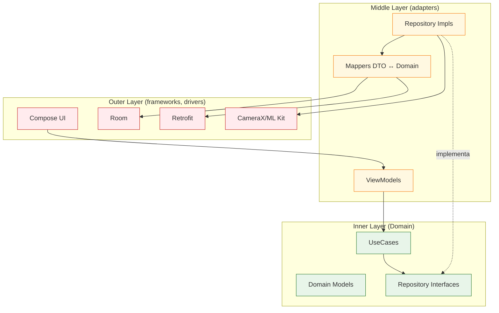
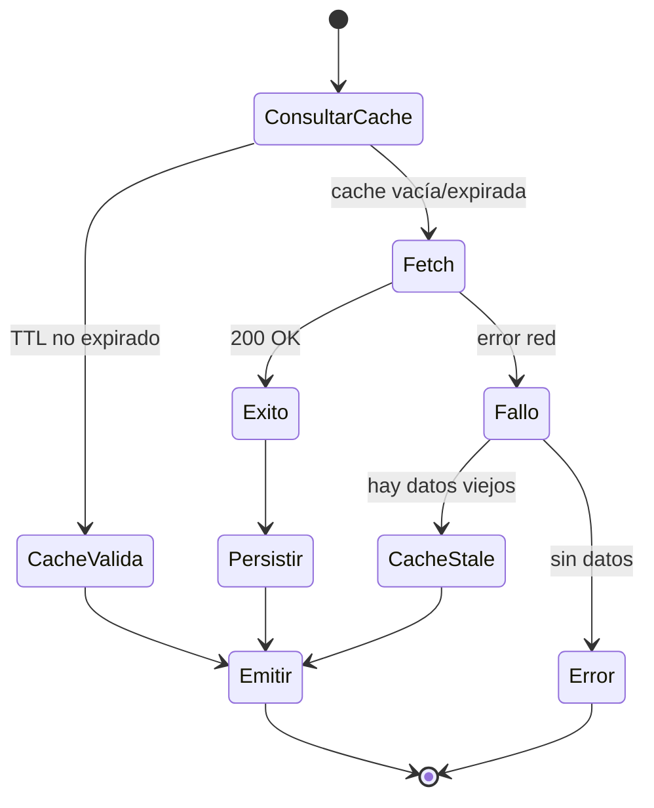
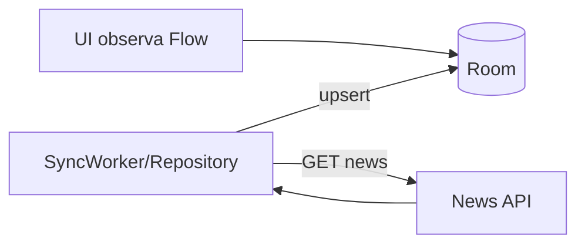
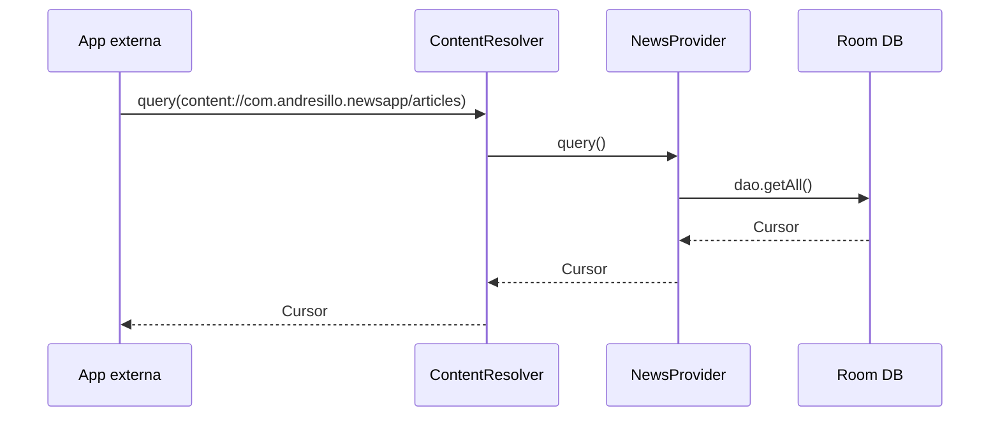
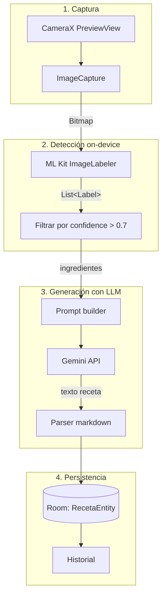

# Arquitectura

Este documento describe las decisiones arquitecturales aplicadas a los proyectos del repositorio. No todos los talleres usan el mismo nivel de estructura — la complejidad debe acompañar al problema, no preceder.

---

## Filosofía

> **No hay una arquitectura "correcta" — hay una arquitectura adecuada para el problema.**

Los proyectos escalan en complejidad arquitectural conforme escala su scope:

| Proyecto | Capas | Justificación |
|---|---|---|
| `taller01-hola-compose` | UI plana | Sin estado complejo ni I/O. Agregar capas sería over-engineering. |
| `taller02-tareas` | UI + ViewModel | Estado en memoria, sin persistencia ni red. |
| `taller03-clima` | Clean (3 capas) | Red + caché → necesita abstracción de fuente de datos. |
| `taller04-finanzas` | Clean + UseCases | Lógica de negocio compleja (cálculos, agregaciones, gráficos). |
| `taller05-recetas` | Clean + UseCases | Pipeline multimodal (cámara → ML → LLM) requiere desacoplar etapas. |
| `NewsApp` | Clean + Provider | Exposición vía ContentProvider exige separación clara data/domain. |

**Regla:** introducir una capa solo cuando exista al menos una segunda implementación posible o un boundary real (red, disco, sensor, IPC).

---

## Las tres capas



### Domain (núcleo)

- **Puro Kotlin.** Sin imports de Android, Retrofit, Room, ni de ningún framework.
- Define **modelos de negocio** (`Weather`, `Movimiento`, `Receta`) que reflejan el lenguaje del dominio, no la forma del JSON o la tabla.
- Define **interfaces de repositorios** (`WeatherRepository`) que declaran QUÉ se necesita, sin importar el CÓMO.
- Contiene **UseCases** (`GetWeatherForCityUseCase`) que orquestan la lógica de negocio.

### Data

- **Implementa** las interfaces del Domain (`WeatherRepositoryImpl`).
- Conoce los detalles de Retrofit, Room, ML Kit, etc.
- Usa **mappers** para convertir DTOs/Entities ↔ Domain Models. La UI **nunca** ve un DTO.
- Decide políticas de caché, expiración, retry, fallback offline.

### Presentation

- `ViewModel` expone `StateFlow<UiState>` consumido por composables.
- Los composables son **stateless** cuando es posible (reciben estado, emiten eventos).
- `UiState` es un sealed/data class que modela explícitamente Loading / Success / Error.

---

## Patrón UiState

```kotlin
sealed interface WeatherUiState {
    data object Loading : WeatherUiState
    data class Success(val weather: Weather) : WeatherUiState
    data class Error(val message: String) : WeatherUiState
}
```

Beneficios:
- La UI no tiene que combinar booleanos (`isLoading && !hasError && data != null`).
- Tests del ViewModel pueden assertear el estado completo.
- Compose recomposes deterministas por cambio de tipo.

---

## Inyección de dependencias con Hilt

Hilt se usa en `taller03`, `taller04`, `taller05`, `NewsApp`. Los módulos siguen este patrón:

```mermaid
flowchart LR
    APP[Application<br/>@HiltAndroidApp] --> SC[SingletonComponent]
    SC --> NM[NetworkModule]
    SC --> DM[DatabaseModule]
    SC --> RM[RepositoryModule]

    NM -->|provides| RETROFIT[Retrofit + OkHttp]
    DM -->|provides| ROOM[RoomDatabase + DAOs]
    RM -->|binds| REPO_IMPL[Repository Impl<br/>→ Repository Interface]

    ACTIVITY["@AndroidEntryPoint<br/>MainActivity"] --> VMC[ViewModelComponent]
    VMC --> VM["@HiltViewModel<br/>WeatherViewModel"]
    VM -.inyecta.-> UC[UseCase]
    UC -.inyecta.-> REPO_IMPL
```

**Convención:** `@Provides` para clases de terceros (Retrofit, Room), `@Binds` para mapear interfaces propias a sus impls.

---

## Flujo de datos: caché-first vs network-first

### Taller 03 (clima) — caché con TTL



**Decisión:** caché válida → no consultar red. Resiliente a red intermitente.

### NewsApp — offline-first

Room es la **única fuente de verdad** que la UI observa (`Flow<List<Article>>`). El sync con la red ocurre en background y actualiza Room; la UI recompone reactivamente.



**Beneficio:** la app funciona sin red. Cuando hay red, los datos se actualizan transparentemente.

---

## ContentProvider en NewsApp

`NewsApp` expone un `ContentProvider` que permite a otras apps del dispositivo consultar el caché de noticias.



**Trade-offs:**
- ✓ Permite IPC sin servicios bound complicados.
- ✗ Acopla el modelo público al schema de Room — un cambio de columna rompe consumidores.
- → Mitigación: definir un contrato (`NewsContract`) y mapear explícitamente, no exponer el `Cursor` crudo del DAO.

---

## Pipeline multimodal — Taller 05

El taller de recetas combina tres tecnologías heterogéneas. La separación en UseCases mantiene cada paso testeable de forma aislada.



**Por qué ML Kit on-device antes de Gemini:**
- ML Kit corre local → privacidad + offline + sin latencia de red.
- Filtramos labels antes de mandar al LLM → prompts más cortos = más baratos y deterministas.
- Si no hay labels confiables, evitamos llamar a Gemini con basura.

---

## Tests

Cada capa se testea con herramientas distintas:

| Capa | Herramienta | Qué se testea |
|---|---|---|
| Domain | JUnit puro | Lógica de UseCases, sin mocks de Android |
| Data | JUnit + MockWebServer / Robolectric | Mappers, parsing, queries Room en memoria |
| Presentation | Turbine + Coroutines test | Transiciones de `UiState` en el ViewModel |
| UI | Compose UI Test | Composables aislados con `createComposeRule` |

> Estado actual del repo: los talleres no incluyen suite de tests automatizados completa. Se documenta aquí la convención esperada.

---

## Decisiones registradas

### ADR-001: Cada taller es un proyecto Gradle independiente

**Contexto:** ¿Multi-módulo único o N proyectos?
**Decisión:** N proyectos independientes, cada uno con su propio wrapper.
**Consecuencias:**
- ✓ Cada taller compila y se versiona por separado, fácil de presentar.
- ✓ No hay acoplamiento accidental entre talleres.
- ✗ Duplicación de configuración Gradle.
- ✗ Cada uno requiere su propio sync.

### ADR-002: `local.properties` para secretos

**Contexto:** ¿Dónde guardar API keys?
**Decisión:** `local.properties` (gitignored) + `BuildConfig` field.
**Consecuencias:**
- ✓ Convención estándar de Android, soportada por Gradle out of the box.
- ✓ Imposible de commitear si el `.gitignore` está bien.
- ✗ El APK release contiene la key en el bytecode → no apto para producción real (allí: backend proxy o EncryptedSharedPreferences).

### ADR-003: Material 3 como design system

**Contexto:** Material 2 vs Material 3.
**Decisión:** Material 3 en todos los proyectos.
**Consecuencias:**
- ✓ Soporte de dynamic color (Android 12+).
- ✓ APIs más consistentes con Compose.
- ✗ minSdk 24 implica fallback de color schemes en versiones antiguas.

---

## Referencias

- [Guide to app architecture (Android)](https://developer.android.com/topic/architecture)
- [Clean Architecture — Robert C. Martin](https://blog.cleancoder.com/uncle-bob/2012/08/13/the-clean-architecture.html)
- [Compose state and Jetpack Compose](https://developer.android.com/jetpack/compose/state)
- [Hilt — Dependency injection](https://developer.android.com/training/dependency-injection/hilt-android)
